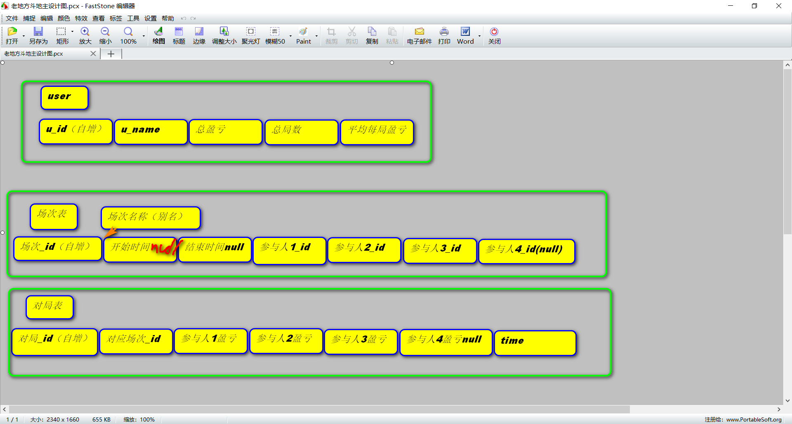

# LaoDiFang_doudizhu
老地方斗地主计分表

因为使用微信群频繁收发红包会被系统检测为赌博行为，而手工计分又经常性出错，所以需要一款值得信赖的工具，此项目作用不止于计分，还兼具统计分析的后叙性扩展。
## 数据库建立
   数据库采用MySQL
   
   库名：laodifang_doudizhu
   
   表结构如图：
   
   
## 服务器端的功能
### 1.首次启动选择建立数据表
   非首次启动，进行数据库自检，删除开始时间为null的场次，检查【场次表】中是否有未结束的场次（结束时间为null），选择将其结束或是继续保留。
   
   再检查**当前对局表**的项数是否超过阈值（），如超过，将另行建立新的对局表，并将其作为当前对局表
   
### 2.自检完成后，等待客户端连接
   暂且考虑epoll伪并发，这样的话要自建通信协议，客户端发送的消息将分为多种模式

## web端的功能
### 1.首页账号登陆模式
   暂且只初始化两个账号：管理员：laodifang12345 （用于数据录入） 和 游客：12345 （只能查看数据） （暂时可以不做这个功能）
### 2.登陆之后进入二级界面
   1.创建一场新的游戏------>创建界面（setup）
   
   2.继续一场已经开始的场次------>继续界面(goon)
   
### 2.1 创建界面
   选择游戏参与者，可以直接添加新的名字----->游戏界面(begin)
### 2.2 继续界面(还没想好解决方案)
   给出一小时以内的未结束场次编号与参与者名字------->游戏界面
   
   如没有，直接返回-------->创建界面
### 3.游戏界面
   直接显示3或4名玩家总分，并给出查看当前场次历史纪录按钮(select)
   
   给出3或4名玩家的名字对应的输入框，以输入获胜玩家当局所赢的分数，失败方由系统自动计算
   提交之后页面刷新(record)
   
   给出一个中途换人的选项，谁------>谁（允许直接添加新玩家）(change)
   
   给出一个结束当前场次的按钮(close)
   
   
  
   
